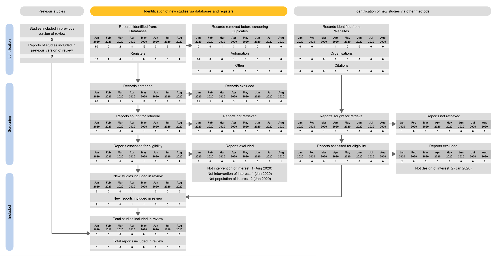

# livingPRISMAflow 

Living systematic reviews should be reported in as much detail as possible, ideally using a standardised flow diagram to show the fate of all evidence identified, screened and included. The PRISMA 2020 flow diagram is the latest update of the PRISMA flow diagram. This package allows users to produce bespoke flow diagrams modelled after PRISMA. Users can choose whether to include 'previous' and 'other' arms of the flow diagram, and multiple updates are included from the template CSV file as separate columns in each box of the diagram.
 

 

Install the package using the following code:

`devtools::install_github("nealhaddaway/livingPRISMAflow")`
 
 
Please cite as:
Neal R Haddaway (2021). livingPRISMAflow: R package and ShinyApp for producing living PRISMA flow diagrams (Version 0.0.1). zenodo. https://doi.org/10.5281/zenodo.4572459
 

<!-- badges: start -->

<!-- badges: end -->
